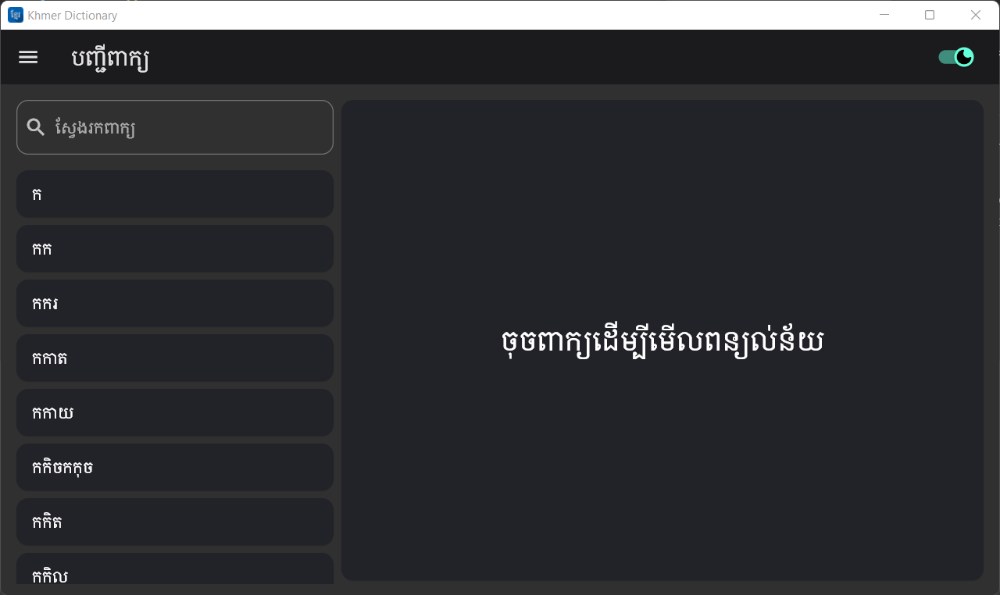
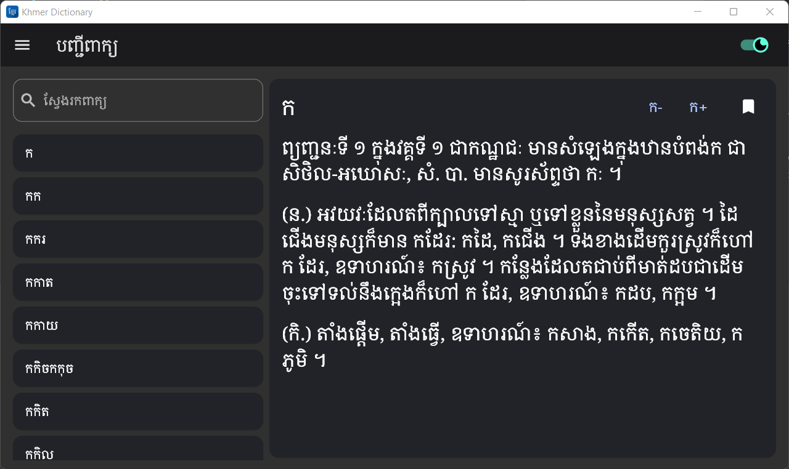
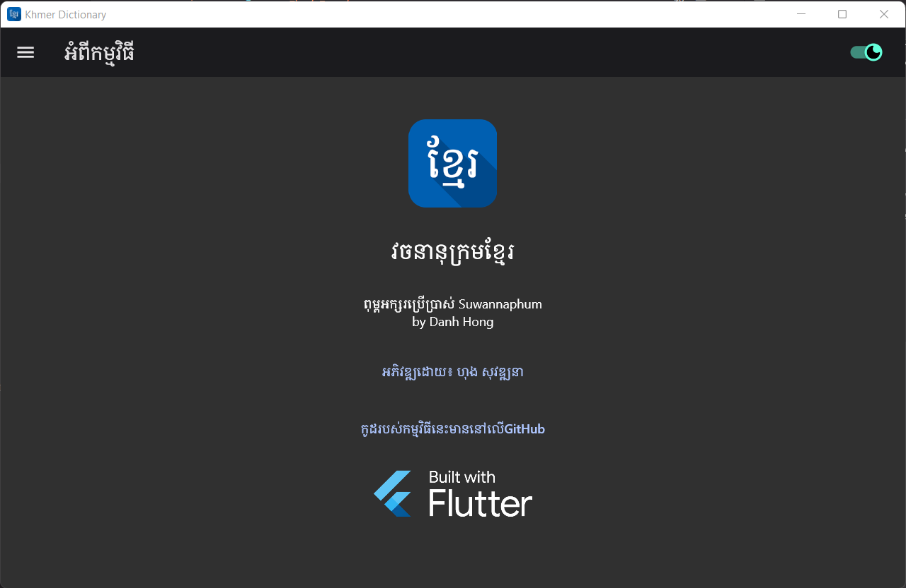
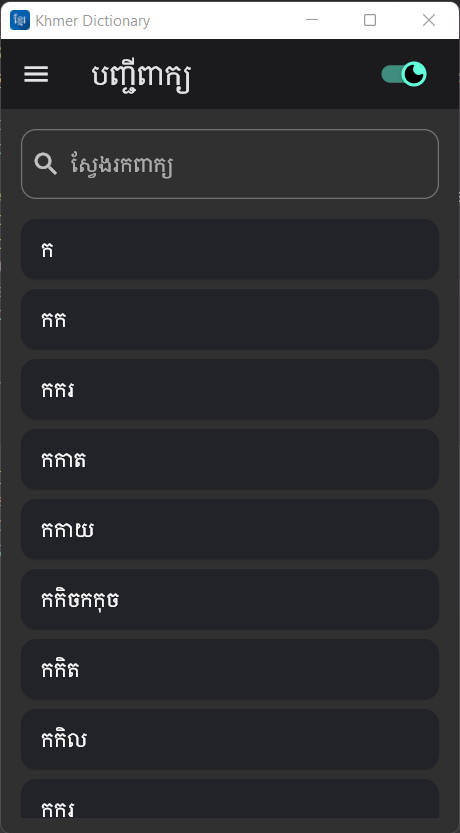
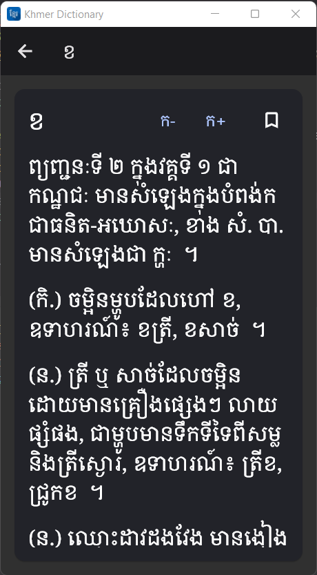

# វចនានុក្រមខ្មែរឌីជីថល (សម្តេចព្រះសង្ឃរាជ ជួន ណាត ជោតញ្ញាណោ)

Digital Khmer Dictionary (Samdech Sangha Rāja Jhotañāno Chuon Nath)

This app is written with flutter. I have written this app out of curiosity to learn new things and to understand about flutter app development.

This app is also available in other programming languages and platform. Check them out below.

[Android](https://github.com/sovathna/Khmer-Dictionary)

[iOS SwiftUI](https://github.com/sovathna/khmerdictionary)

[Compose Desktop](https://github.com/sovathna/compose-dictionary)

[UWP](https://github.com/sovathna/UwpDictionary)

# រូបភាព

| បញ្ជីពាក្យ                 | ពន្យល់ន័យ                   | អំពីកម្មវិធី                |
|----------------------------|----------------------------|----------------------------|
|  |  |  |
| បញ្ជីពាក្យ                 | ពន្យល់ន័យ                   |
|  |  |
